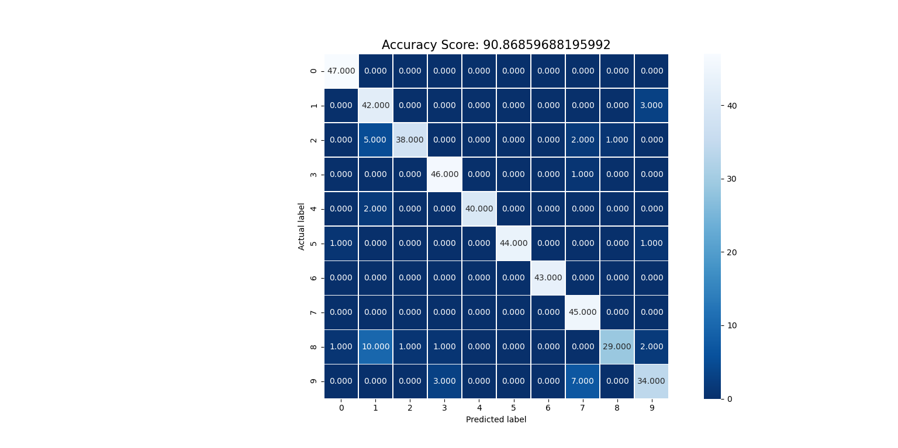
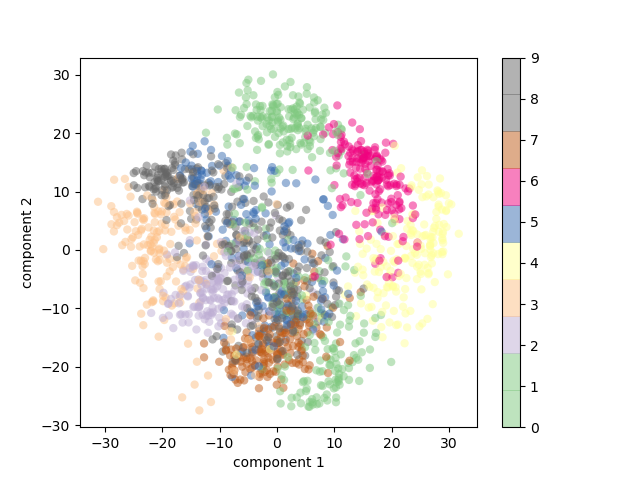

***Multiclass Unregularized logistic Regression***

**4 fold Cross Validation**

    Accuracy of 1 th fold: 90.86859688195992

    Accuracy of 2 th fold: 86.6369710467706

    Accuracy of 3 th fold: 84.40979955456571

    Accuracy of 4 th fold: 84.40979955456571

This is the average accuracy 

    Accuracy:- 86.58129175946549

This is best accurray of unregularized multiclass logisticregression:-

    Accuracy:  90.86859688195992

**Confusion matrix of best Logistic Regressor**

**Principle componenet Analysis**

