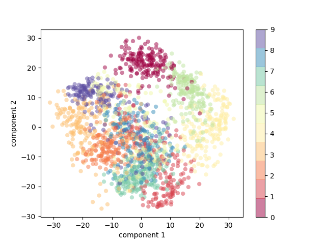

***Multiclass Unregularized logistic Regression***

**4 fold Cross Validation**

    Accuracy of 1 th fold: 90.86859688195992

    Accuracy of 2 th fold: 86.6369710467706

    Accuracy of 3 th fold: 84.40979955456571

    Accuracy of 4 th fold: 84.40979955456571

This is the average accuracy 

    Accuracy:- 86.58129175946549

This is best accurray of unregularized multiclass logisticregression:-

    Accuracy:  90.86859688195992

**Confusion matrix of best Logistic Regressor**

According to the confusion matrix we can see that 1 and 8 are the most confused digits. While zero is easiest to predict because all the actual labels are predicted correctly.

**Principle componenet Analysis**

PCA plot is ploted across highest variance so that we can cover more information of the image in the specified component. The graph shows that what is the proportion of two components in 9 digits. It also shows that each digit is how much related to each other.