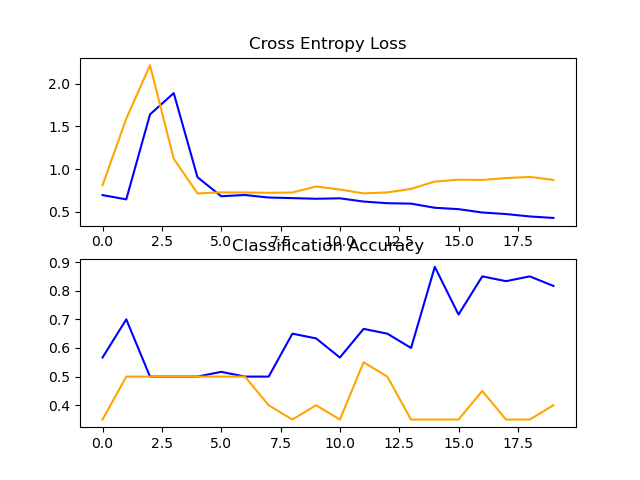

Blue :- Training

Orange :- Validation

**VGG MODEL**

Accuracy:-40%

**VGG MODEL WITH AUGMENTATION**

Accuracy:-50%

**VGG MODEL WITH TRANSFER**

Accuracy:-80%

**Prediction**

From here we can see that result of

     VGG< VGG with augmentation < VGG with transfer learning

***Information regarding dataset creation is in COLAB***
